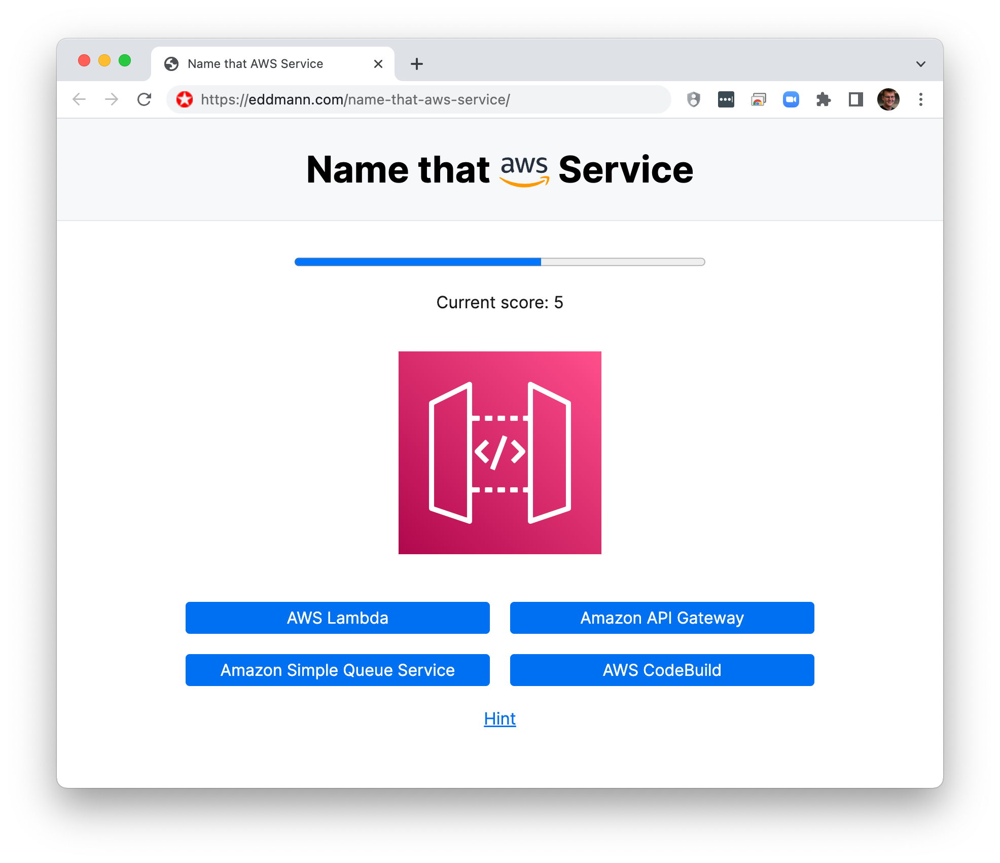

# Name that AWS Service

AWS provides _alot_ of services... and keeping up with them can be tough.
This is a small daily trivia game I built which quizes you on 10 different AWS service icons.

Each day a new quiz is generated (via [GitHub Actions](./.github/workflows/generate.yml)) and the results are stored within your Local Storage (similiar to how Wordle operates).

